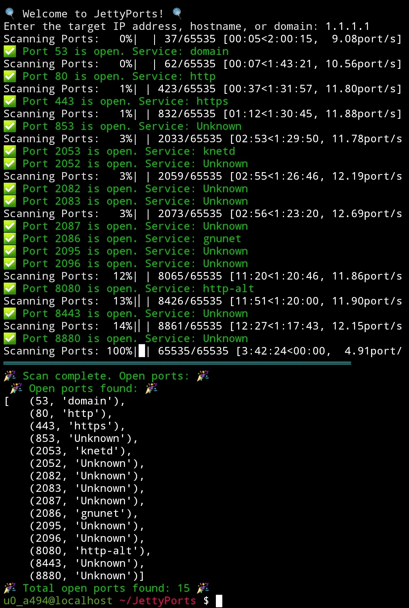

# JettyPorts - Network Port Scanner

 ☆ **NOTE:** ``Update 1.1 is in the making! What comes next? Decide if you wanna scan all possible ports or select the range yourself and more 😉``



"JettyPorts" is a robust Python tool specifically designed for swiftly scanning open ports on target systems, whether they are specified by IP address, hostname, or domain. Employing asyncio and concurrent.futures, JettyPorts excels in executing asynchronous port scans, ensuring optimal performance by concurrently probing multiple ports. Its intuitive interface boasts colorful and informative output, featuring emojis to denote scan results, thus enhancing user interaction and readability. Leveraging socket operations, JettyPorts meticulously assesses each port's accessibility, delivering prompt and accurate findings. Moreover, the tool gracefully handles interruptions, guaranteeing a seamless user experience. Named JettyPorts, this tool embodies versatility and efficiency, making it an invaluable asset for network administrators, cybersecurity professionals, and enthusiasts alike, seeking to fortify network security by identifying and addressing potential vulnerabilities efficiently.

# JettyPorts Feature List

1. **Asynchronous Port Scanning**: JettyPorts leverages asyncio and concurrent.futures to conduct asynchronous port scans, enabling concurrent probing of multiple ports for optimal speed and efficiency.

2. **Flexible Target Specification**: Users can specify the target for port scanning by providing an IP address, hostname, or domain name, enhancing versatility and usability.

3. **Colorful Output**: JettyPorts delivers colorful output using the colorama library, enhancing readability and providing visual cues for scan results such as open ports, errors, and warnings.

4. **Emoji-based Status Indicators**: The tool employs emojis to denote scan results, with symbols like ✅ for success, ⚠️ for warnings, and ❌ for errors, making it easy for users to interpret the findings at a glance.

5. **Interrupt Handling**: JettyPorts gracefully handles user interruptions, ensuring a smooth scanning process by catching KeyboardInterrupt exceptions and stopping the scan without compromising data integrity.

6. **Progress Bar Display**: Utilizing the tqdm library, JettyPorts presents a progress bar during the scan, offering real-time feedback on the scanning progress and estimated time remaining.

7. **Service Identification**: For open ports, JettyPorts attempts to identify the corresponding service using socket.getservbyport(), providing additional context about the services running on the target system.

8. **Error Handling**: The tool includes robust error handling mechanisms to gracefully handle socket errors and other exceptions, ensuring reliability and stability during the scanning process.

9. **Modular Design**: JettyPorts is designed with modularity in mind, making it easy to integrate into existing projects or extend its functionality with additional features or customizations.

10. **Usability**: With its intuitive interface and straightforward usage, JettyPorts caters to both novice users and experienced professionals, offering a hassle-free experience for port scanning tasks.

11. **Efficient Resource Utilization**: By utilizing asynchronous programming techniques and efficient concurrency management, JettyPorts optimizes resource utilization, minimizing overhead and maximizing scanning speed.

12. **Comprehensive Scan Results**: Upon completion of the scan, JettyPorts provides a detailed summary of the open ports found on the target system, including their corresponding services and total count.

13. **Security Assessment**: JettyPorts serves as a valuable tool for security professionals and network administrators, facilitating the identification of potential vulnerabilities and aiding in the fortification of network defenses.

14. **Cross-platform Compatibility**: JettyPorts is designed to run on various operating systems, ensuring compatibility and accessibility across different environments.

15. **Community Support**: As an open-source project, JettyPorts benefits from community contributions, feedback, and support, fostering ongoing development and improvement of the tool's features and functionality.

## Installation

1. Clone the repository:
   ```
   git clone https://github.com/AnonCatalyst/JettyPorts
   ```

2. Install dependencies using pip:
   ```
   pip install -r requirements.txt
   ```

## Usage

1. Run the script:
   ```
   python3 jetty.py
   ```

2. Enter the target IP address, hostname, or domain when prompted.

3. Wait for the scan to complete.

4. View the results:
   - Open ports and corresponding services are displayed.
   - If no open ports are found, a message notifies the user.

## Customization

- **Timeout**: Adjust the timeout duration for port scanning by modifying the `timeout` parameter in the `port_scan_async` function.
- **Port Range**: Modify the `start_port` and `end_port` parameters in the `port_scan_async` function to specify a custom port range.
